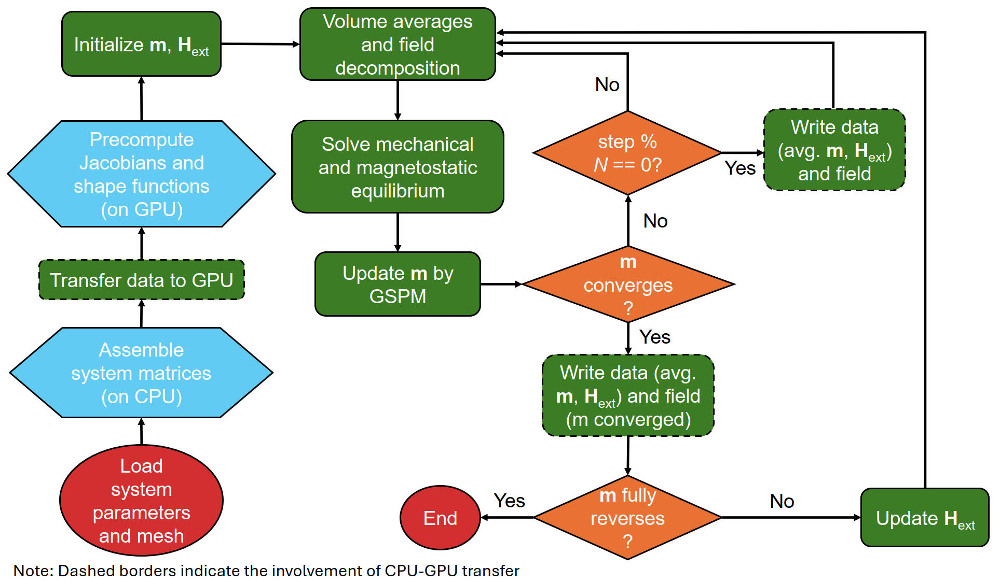

# CuPyMag

CuPyMag is an open-source, Python-based finite-element micromagnetic simulation framework with a fully GPU-resident workflow. Sparse system matrices are assembled once on the CPU with Numba-JIT, then transferred to the GPU where fundamental FEM operations such as spatial derivatives, volume averages, right-hand-side updates, and iterative solves are expressed as tensorized routines in CuPy to minimize host–device communication. Time integration of the Landau–Lifshitz–Gilbert equation uses the Gauss–Seidel projection method, which reduces each step to solving well-conditioned Poisson-like systems and supports up to ~10 picosecond timesteps. The framework includes magnetoelastic coupling (mechanical equilibrium with magnetostriction at each time step), non-ferromagnetic defect with arbitrary geometries, and the ellipsoid theorem to connect local fields with macroscopic boundary conditions.

## Features

- Finite-element micromagnetic simulations on unstructured meshes
- Pure-Python, high-performance stack (Numba, CuPy)
- Fully GPU-resident workflow with batched tensor operations
- Gauss–Seidel projection method for stable LLG time integration
- Simulation time scales sub-linearly with problem size
- Memory-bound performance
- Double and single precision modes
- Magnetoelastic coupling (mechanical equilibrium each time step)
- Ellipsoid theorem for multi-scale modeling
- Non-magnetic defect with arbitrary shapes

## Installation

### Requirements

- Python 3.8+
- CUDA-compatible GPU
- CUDA Toolkit 11.0+
- NumPy, CuPy, SciPy, Numba, Pandas, PyYAML, Meshio, H5py

### Install from source

```bash
git clone https://github.com/hongyiguan/CuPyMag.git
cd CuPyMag
pip install -e .
```

## Quick Start

1. **Copy example configuration:**

   ```bash
   cp examples/example_config.yaml .
   ```
2. **Run simulation:**

   ```bash
   cupymag example_config.yaml
   ```

## Configuration

All simulation parameters are specified in a YAML configuration file with four main sections:

### Physics Parameters

Define the physical properties of the material and its couplings:

- **Magnetic properties**: Saturation magnetization, exchange stiffness, anisotropy constants
- **Elastic constants**: Stiffness tensor components ($c_{11}$, $c_{12}$, $c_{44}$) for stress calculations of a cubic symmetry material
- **Magnetostriction**: Magnetostriction constants $\lambda_{100}$ and $\lambda_{111}$ for a cubic symmetry material
- **Demagnetization factors**: User-defined demag factors (e.g. ellipsoid theorem inputs)
- **External field**: Applied magnetic field components and sweep rates
- **External stress**: Applied stress tensor
- **Coupling options**: Magnetoelastic coupling switch, crystallographic rotation (x-axis → [111])
- **Length scales**: Characteristic system length

### Grid Parameters

Specify the computational domain and mesh type:

- **Mesh type**: `"Hex"` (structured cubic) or `"Tet"` (tetrahedral mesh from file)
- **Defect center**: Defaults to domain center, can be overridden
- **Cubic mesh**: Domain resolution (`nx, ny, nz`) and defect size (`ndx, ndy, ndz`)
- **Tetrahedral mesh**: External mesh file, defect shape (sphere/ellipsoid/rotated ellipsoid), size parameters, optional rotation matrix

### Simulation Parameters

Control the numerical integration, solvers, and run logic:

* **Precision**: `"DP"` (double) or `"SP"` (single) floating-point precision
* **LLG integration**: Time step size, damping constant, and convergence tolerance for Landau–Lifshitz–Gilbert dynamics
* **Solver settings**: Conjugate Gradient tolerance, maximum iterations, and initial condition
* **Restart capability**: Resume from a saved magnetization state or start from uniform initialization
* **Initial magnetization**: Determines the initial magnetization if not resumed from a saved state
* **Stop conditions**: Automatic termination based on magnetization component thresholds

### Output Settings

Configure file output and data recording:

* **Directory**: Destination folder for results
* **Magnetization output**: Write latest magnetization state to HDF5 alongside VTU output
* **Save frequency**: Number of time steps between field dumps
* **Visualization blending**: Nodal vs. cell-centered weighting for VTU output (`vtu_blend_alpha`)

See `examples/` for a complete example with more details.

## Usage Examples

### Basic simulation and output

CuPyMag's primary usage is to solve micromagnetic problems. For this case, just copy the template file `example_config.yaml` at `examples/` and modify the parameters according to your specific material. Then run the simulation:

```bash
cupymag my_config.yaml
```

For the linear tetrahedron mesh, you need to prepare a mesh file with **NASTRAN (`.nas`) format**. For example, you can **export directly from COMSOL** in `.nas` format. Alternatively, you can **generate a mesh with Gmsh** (`.msh`) and convert it to `.nas` using meshio.

```python
import meshio

mesh = meshio.read("mesh.msh")   
meshio.write("mesh.nas", mesh)   
```

#### Output

Simulations generate:

* VTU files for visualization in ParaView
* HDF5 files for magnetization data
* Hysteresis loop data in text format
* Console output with simulation progress

Here is a summary of the workflow of CuPyMag:



*Figure1: Flowchart of CuPyMag*

### Experimental extensions

CuPyMag follows a mathematically transparent structure: it directly mirrors FEM theory and avoids unnecessary abstraction layers. This makes it easy to extend beyond micromagnetics. Developers are encouraged to treat CuPyMag as a general FEM solver library with CuPy, adapting it to their own problems. For demonstration, there are some examples you can find in [`examples/experimental/`](examples/experimental). These illustrate how to use CuPyMag as a general FEM toolkit:

**ex1: Grid generation**
Generate a structured cubic grid and export it as a VTU file for visualization.

**ex2: Field operations**
Compute volume average and spatial derivatives of an arbitrary field.

**ex3: Poisson solver**
Solve a 3D Poisson equation and visualize the solution.

**ex4: Elasticity solver**
Solve 3D mechanical equilibrium with cubic symmetry and linear strains, and visualize the strains.

## License

Licensed under the Apache License, Version 2.0. See LICENSE file for details.

## Citation

If you use CuPyMag in your research, please cite:

```bibtex
@article{GUAN2026110093,
   title = {CuPyMag: GPU-accelerated finite-element micromagnetics with magnetostriction},
   journal = {Computer Physics Communications},
   volume = {323},
   pages = {110093},
   year = {2026},
   issn = {0010-4655},
   doi = {https://doi.org/10.1016/j.cpc.2026.110093},
   author = {Hongyi Guan and Ananya {Renuka Balakrishna}}
}

@software{cupymag2026,
  author = {Hongyi Guan},
  title = {CuPyMag: GPU-Accelerated Finite-Element Micromagnetics with Magnetostriction},
  year = {2026},
  version = {0.9.1},
  url = {https://github.com/hongyiguan/CuPyMag}
}
```

## Contribution & Extension

CuPyMag is built to be extended. Its modular FEM design allows developers to add new physics modules, custom solvers, or adapt it for problems beyond micromagnetics. If you build an extension or adaptation, feel free to share it via pull requests or discussions. Contributions are warmly welcomed.
